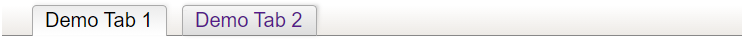

# jquery.simpletabs v1.2.0

The `jquery.simpletabs` plugin shows a tabs bar for navigation. The tabs can be defined once, and shared across multiple HTML pages. Multiple tabs bars can be shown on a page for nested navigation.</p>



## Usage

```
<link href="/path/to/jquery.simpletabs/jquery.simpletabs.css" rel="stylesheet" type="text/css" media="all" />
<script src="/path/to/jquery.simpletabs.js" type="text/javascript" charset="utf-8"></script>
<script src="https://code.jquery.com/jquery-latest.js" type="text/javascript" charset="utf-8"></script>
<script src="/path/to/jquery.simpletabs.js" type="text/javascript" charset="utf-8"></script>
<script>
  let tabsConfig = {
    tabs: [
      {
        id:      'demoTab1',
        label:   'Demo Tab 1',
        tooltip: 'This is demo tab 1',
        url:     'demo-tab-1.html'
      }, {
        id:      'demoTab2',
        label:   'Demo Tab 2',
        tooltip: 'This is demo tab 2',
        url:     'demo-tab-2.html'
      }
    ]
  };
  $(document).ready(function() {
    $('#simpleTabsDemo').simpleTabs(tabsConfig, 'demoTab1');
  });
</script>
<div id="simpleTabsDemo"></div>
```

Define the tabs configuration once as an object in a JavaScript file. Include that in your HTML pages, and pass the tabs configration object as the first parameter to `.simpleTabs()`. The second parameter indicates the ID of the active tab. Above example is for the first page `demo-tab-1.html`. 

## Configuration

Pass a configuration object to `.simpleTabs()`:

```
{
  tabs: [
    {
      id:       'demoTab1',         // HTML ID of tab, must be unique per page, required
      label:    'Demo Tab 1',       // tab label, required
      tooltip:  'This is a demo',   // tooltip message for tab, optional
      url:      'demo-tab-1.html',  // page/anchor URL, required
      spacers:  2,                  // number of spacers preceeding tab, optional, default: 1
      tabClass: 'forAdminOnly',     // add classes to tab, optional, default: 'jqSimpleTabsTab'
      spacerClass: 'forAdminOnly'   // add classes to spacer, optional, default: 'jqSimpleTabsSpacer'
    },
    // etc...
  ],
  debug: false
}
```

## Demo

See [demo.html](https://peterthoeny.github.io/jquery.simpletabs/demo.html)
